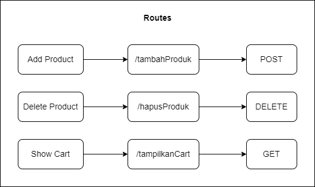

# Shopping Cart API
[](https://golang.org/)

## Quick Start
---
### Run App
```
go run main.go
```
### Unit Test
```
# Run all tests
go test -v

# Add Product Test
go test -run TestTambahProduk -v

# Delete Product Test
go test -run TestHapusProduk -v

# Show Cart Test
go test -run TestTampilkanCart -v
```

## Project Diagram
---
